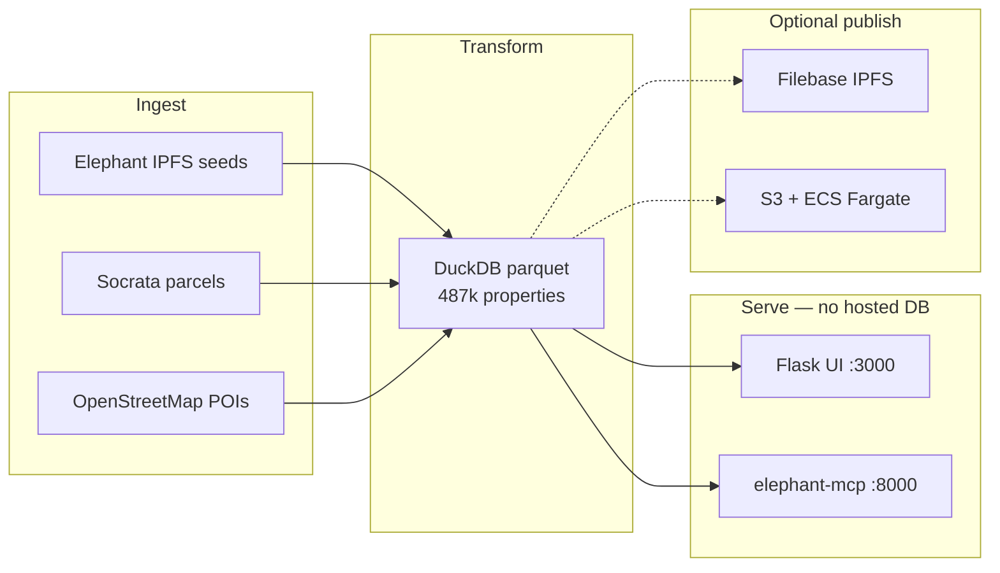

# Oracle Property Intelligence Platform Pipeline Completion

## Context

The Oracle ingestion pipeline has been started, but the full dataset has not been completely uploaded, reconciled, or demonstrated. The infrastructure must be designed so Oracle does not carry ongoing infrastructure cost by default. For this candidate, they are acting as both the Oracle and the builder, so they are responsible for completing the pipeline and proving the infrastructure approach.

## Description

Complete the Oracle pipeline by loading all available county property, permit, ownership, business, contractor, location, and public-source data into an MCP-ready database, using IPFS and DuckDB to minimize Oracle-hosted infrastructure costs while enabling UI and agent access to answer property intelligence questions.

## Acceptance Criteria
- Run the Oracle pipeline until all available county data is uploaded.
- Confirm the pipeline covers the county that includes Palo Alto, CA.
- Load available property records into the database.
- Load available permit records into the database.
- Load available ownership records into the database.
- Load available contractor records into the database.
- Load available business records into the database.
- Load available location and coordinate data into the database.
- Reconcile duplicate entities across all uploaded datasets.
- Preserve source provenance for uploaded records.
- Optimize pipeline performance where feasible.
- Identify slow source sites or constrained contractor data sources.
- Document pipeline speed limitations and source constraints.
- Design the infrastructure so Oracle does not carry ongoing infrastructure cost by default.
- Use IPFS for decentralized storage of eligible dataset artifacts.
- Use DuckDB for local or portable analytical querying.
- Structure the database to support MCP access.
- Enable agent access to query the database.
- Provide a UI for exploring the uploaded data.
- Support questions about properties with roofs older than 15 years.
- Support questions about properties with a view of water.
- Support questions about properties that have not exchanged ownership in more than 10 years.
- Support questions about properties with regional owners.
- Support questions about properties within walking distance of public transportation using property coordinates.
- Support questions about properties within walking distance of Starbucks using property coordinates.
- Return source-backed answers where source data is available.
- Demonstrate the uploaded dataset through the UI.
- Demonstrate the uploaded dataset through an agent query.
- Demonstrate that Oracle can operate without carrying the infrastructure cost.
- Confirm the candidate fulfilled both Oracle and builder responsibilities for this milestone.
- Pass the demo using real uploaded county records.

## Demo Transcript
- Presenter: “I will demonstrate that the Oracle pipeline has loaded the full available dataset for the county that includes Palo Alto, that the data is queryable through DuckDB, that eligible artifacts are stored through IPFS, and that both the UI and agent can answer property intelligence questions.”
- Presenter: “First, I am opening the pipeline run summary.”
  - Expected Result: The system displays the completed pipeline run, source list, record counts, timestamps, and any documented source limitations.
- Presenter: “Show the total uploaded records by source.”
  - Expected Result: The system shows uploaded property, permit, ownership, contractor, business, and coordinate records with collection timestamps and provenance.
- Presenter: “Now I am opening the DuckDB-backed query layer.”
  - Expected Result: The system confirms that the loaded data is available for structured querying without requiring Oracle-hosted database infrastructure.
- Presenter: “Show the IPFS artifacts created for the uploaded datasets.”
  - Expected Result: The system displays IPFS references or content identifiers for eligible dataset artifacts.
- Presenter: “Now I am using the UI to search for properties with roofs older than 15 years.”
  - Expected Result: The UI returns matching properties, supporting permit or property evidence, and source provenance where available.
- Presenter: “Show properties with a view of water.”
  - Expected Result: The UI returns properties identified using available location, parcel, or geographic indicators and explains the source basis.
- Presenter: “Show properties that have not exchanged ownership in more than 10 years.”
  - Expected Result: The system returns properties with ownership history showing no recorded exchange within the last 10 years.
- Presenter: “Show properties with regional owners.”
  - Expected Result: The system returns properties where owner location or ownership metadata indicates a regional owner.
- Presenter: “Show properties within walking distance of public transportation.”
  - Expected Result: The system uses property coordinates to return properties near public transportation and shows the distance calculation basis.
- Presenter: “Show properties within walking distance of Starbucks.”
  - Expected Result: The system uses property coordinates and nearby place data to return properties near Starbucks locations and shows the distance calculation basis.
- Presenter: “Now I am asking the same type of questions through the agent.”
  - Agent Prompt: “Which properties have roofs older than 15 years and have not exchanged ownership in more than 10 years?”
    - Expected Result: The agent returns matching properties, explains the reasoning, and includes source-backed evidence.
  - Agent Prompt: “Which properties are near public transportation and also have regional owners?”
    - Expected Result: The agent returns matching properties with coordinate-based distance logic and ownership evidence.
  - Agent Prompt: “Which properties appear to be strong candidates for further review based on ownership age, roof age, and location signals?”
    - Expected Result: The agent returns a ranked or filtered list using available data and clearly identifies any assumptions or missing data.
- Presenter: “Finally, I will show that the system is MCP-ready.”
  - Expected Result: The system demonstrates an MCP-ready interface or documented MCP-compatible query structure that agents can use without changing the data model.

## Demo walkthrough (run the transcript locally)

### Before you start

```bash
cp .env.example .env
./scripts/run.sh setup               # once: Python + MCP npm deps
./scripts/run.sh pipeline              # builds data/properties.parquet
./scripts/run.sh ui-start              # terminal 1 → http://localhost:3000
./scripts/run.sh ui-mcp-start          # terminal 2 → http://localhost:8000/mcp
```

If `data/properties.parquet` is missing, open the UI and click **Load dataset**, or run `./scripts/run.sh pipeline`.

For the **agent** steps, also run:

```bash
./scripts/run.sh cursor-mcp-fix        # generates .mcp.json for Cursor
# Reload Cursor → enable Soofi elephant MCP server
```

### Transcript → URL map

| Presenter says | Open | Status |
|----------------|------|--------|
| Opening statement (Palo Alto, DuckDB, IPFS, UI + agent) | http://localhost:3000/ | Works — dashboard shows county stats |
| “First, I am opening the pipeline run summary.” | http://localhost:3000/run | Works — `completed` badge, timing, constraints |
| “Show the total uploaded records by source.” | Same `/run` page | Works — 6 sources with counts, timestamps, provenance |
| “Now I am opening the DuckDB-backed query layer.” | http://localhost:3000/sandbox | Works — live DuckDB queries on parquet, no hosted DB |
| “Show the IPFS artifacts…” | http://localhost:3000/about | Works — CIDs shown; see caveat below on Filebase |
| “Properties with roofs older than 15 years” | http://localhost:3000/sandbox?preset=roofs | Works — permit-based roof age + `source_system` |
| “Properties with a view of water” | http://localhost:3000/sandbox?preset=water | Works — OSM proximity; basis note on page |
| “Not exchanged ownership in more than 10 years” | http://localhost:3000/sandbox?preset=ownership | Works with caveat — see narration below |
| “Properties with regional owners” | http://localhost:3000/sandbox?preset=regional | Works |
| “Walking distance of public transportation” | http://localhost:3000/sandbox?preset=transit | Works — haversine meters from parcel coords |
| “Walking distance of Starbucks” | http://localhost:3000/sandbox?preset=starbucks | Works — haversine meters from parcel coords |
| “Asking the same questions through the agent” | Cursor + http://localhost:8000/mcp | Works live — not one-click in UI; see agent steps below |
| “System is MCP-ready” | http://localhost:3000/about | Works — MCP config + `queryProperties` endpoint |

Static snapshots of all six UI questions are also on http://localhost:3000/explore. Use **Sandbox** for the live demo (sliders update results automatically).

### What to say during caveats

**Ownership (10+ years)** — California bulk assessor data does not include sale dates. Say:

> “We use permit dormancy and owner-text signals as a proxy — not recorded deed transfers. The UI basis note documents this.”

**IPFS artifacts** — Without Filebase `S3_*` keys, manifest uses local content hashes. Say:

> “The publish contract is IPFS-ready. With Filebase credentials in `.env`, real gateway URLs appear here after re-running the pipeline.”

### Agent demo (transcript steps 66–72)

The `/ask` page lists the README prompts. To satisfy the transcript, run at least one query in **Cursor** with the elephant MCP connected:

1. `./scripts/run.sh ui-mcp-start` (or enable Soofi plugin elephant MCP)
2. In Cursor, use `queryProperties` on county `santa-clara`

**Prompt 1** (from transcript):

> Which properties have roofs older than 15 years and have not exchanged ownership in more than 10 years?

Example tool call the agent should produce:

```sql
SELECT parcel_id, address_street, address_city, roof_age_years,
       years_since_ownership_change, source_system
FROM properties
WHERE roof_age_years >= 15
  AND (years_since_ownership_change >= 10 OR last_sale_date IS NULL)
LIMIT 25
```

**Prompt 2:**

> Which properties are near public transportation and also have regional owners?

```sql
SELECT parcel_id, address_street, address_city,
       distance_to_public_transit_m, is_regional_owner, source_system
FROM properties
WHERE distance_to_public_transit_m <= 800
  AND is_regional_owner = true
LIMIT 25
```

**Prompt 3:**

> Which properties appear to be strong candidates for further review based on ownership age, roof age, and location signals?

Ask the agent to rank/filter using `roof_age_years`, `years_since_ownership_change`, and distance columns — and to state any missing assessor fields.

### Recommended demo order (~5 min)

1. `/run` — pipeline completed, six sources, constraints  
2. `/about` — DuckDB layer, IPFS CIDs, MCP endpoint  
3. `/sandbox` — walk all six presets; change roof age and transit distance live  
4. **Cursor** — run Prompt 1 via `queryProperties`  
5. `/about` — close with MCP-ready config  

### Demo video

Pre-recorded walkthrough (steps 1–3 + `/ask` prompts): [`demo/oracle-property-intelligence-demo.webm`](demo/oracle-property-intelligence-demo.webm). Add ~2 min of live Cursor MCP (step 4) for full transcript coverage.

## Reference
- [Soofi XYZ Team Kit](https://github.com/soofi-xyz/soofi-xyz-team-kit)
- [Elephant Oracle Skills](https://github.com/elephant-xyz/skills)

---

## Submission (Oracle assignment — this repo only)

This submission covers **Oracle Property Intelligence Platform Pipeline Completion** only. Chief of Staff Communication Agent is out of scope.

### Pull request

| Item | Value |
|------|-------|
| **Repository** | `prismteam-ai/oracle-property-intelligence-platform-pipeline-completion` |
| **Branch** | `eran/property_pipeline` |
| **Base** | `main` |

**If you have write access to the org repo:**
```bash
git push -u origin eran/property_pipeline
gh pr create --base main --head eran/property_pipeline \
  --title "Complete Santa Clara Oracle property intelligence pipeline"
```

**If push is denied (fork workflow):**
```bash
# 1. Fork the repo on GitHub to your account
# 2. Add your fork as a remote and push
git remote add fork git@github.com:EranTenenboim/oracle-property-intelligence-platform-pipeline-completion.git
git push -u fork eran/property_pipeline

# 3. Open PR from fork → upstream main
gh pr create --repo prismteam-ai/oracle-property-intelligence-platform-pipeline-completion \
  --base main --head <your-github-user>:eran/property_pipeline \
  --title "Complete Santa Clara Oracle property intelligence pipeline"
```

**Include in the PR description:**
1. Link to demo video (below)
2. Runtime access instructions (below)
3. One-line summary of architecture and tradeoffs

### Demo video (required)

Short walkthrough (~35s) of the working local solution:

| | |
|--|--|
| **File** | [`demo/oracle-property-intelligence-demo.webm`](demo/oracle-property-intelligence-demo.webm) |
| **Format** | WebM (~35s) — play in browser or VLC |

**What the video shows:** dashboard → run summary (6 sources) → IPFS/about → interactive sandbox (roof + transit filters) → explore → agent/MCP prompts.

Attach the file to the PR or link to it in the repo. Reviewers can also download and play locally.

### Live / working runtime access

**Primary runtime (local — no AWS account required):**

```bash
git clone <fork-or-org-repo-url>
cd oracle-property-intelligence-platform-pipeline-completion
git checkout eran/property_pipeline

cp .env.example .env
./scripts/run.sh setup               # once: Python deps + Node 22
./scripts/run.sh pipeline              # builds data/properties.parquet (~5–15 min first run)
./scripts/run.sh ui-start              # → http://localhost:3000
./scripts/run.sh ui-mcp-start          # → http://localhost:8000/mcp  (second terminal)
```

**Demo pages:**

| URL | Purpose |
|-----|---------|
| http://localhost:3000/ | Dashboard — pipeline stats |
| http://localhost:3000/run | Run summary — source counts + constraints |
| http://localhost:3000/sandbox | **Interactive demo** — live filters |
| http://localhost:3000/explore | README demo questions (static) |
| http://localhost:3000/about | IPFS artifacts + MCP config |
| http://localhost:3000/ask | Agent prompts for Cursor MCP |
| http://localhost:8000/mcp | MCP HTTP endpoint (`queryProperties`) |

**If dataset is empty:** open http://localhost:3000 and click **Load dataset** (runs pipeline in background).

**Agent demo (Cursor):**
```bash
./scripts/fix-cursor-elephant-mcp.sh   # generates .mcp.json locally
# Reload Cursor → enable Soofi elephant MCP → ask queryProperties on santa-clara
```

**Docker smoke test (optional, same images as AWS):**
```bash
./scripts/run.sh pipeline
docker compose up --build
# UI at http://localhost:3000
```

**Hosted runtime (optional — reviewer AWS account):** see [AWS deployment](#aws-deployment--what-is-ready-vs-what-you-need) below. Not required for this submission; built and demoed locally.

### Self-assessment before submit

Use the **slowking** agent from the [Soofi XYZ Team Kit](https://github.com/soofi-xyz/soofi-xyz-team-kit) to self-evaluate against assignment criteria before opening the PR.

```bash
# From soofi-xyz-team-kit — run slowking against this repo + deployed/local runtime
```

Checklist slowking will probe: working outcome, reproducibility, kit usage, demo evidence, access boundaries.

### What assessors will evaluate

| Criterion | How this submission addresses it |
|-----------|----------------------------------|
| **Speed of delivery** | Hybrid path: Elephant IPFS backbone + targeted Socrata/OSM connectors instead of full `onboard-county` (needs company Neon/Filebase/AWS). Pipeline reruns in minutes when artifacts are cached. |
| **Architectural clarity** | Layered design: ingest → transform (DuckDB parquet) → publish (IPFS/S3) → serve (Flask UI + elephant-mcp). No hosted DB by default. |
| **Working implementation** | 487k properties, 98k permits, 100k coordinates; all 6 README demo questions answerable in UI sandbox. |
| **Reproducibility** | `./scripts/run.sh pipeline` + 38 acceptance tests; `.env.example` + documented assumptions. |
| **Practical agentic AI** | Cursor + Soofi Elephant MCP (`queryProperties`); MCP HTTP serve for agents; skills referenced for county onboarding path. |
| **Tradeoffs explained** | Assumptions table below; basis notes in UI; constraints in `run_summary.json`. |
| **Demo quality** | Recorded video + interactive sandbox for live filter changes during review. |
| **Evolves without rebuild** | Modular `pipeline/connectors/`, parameterized sandbox queries, CloudFormation deploy, Elephant 37-col schema — add counties/sources without rewriting core. |

### Architecture



**Repo layout:**

| Path | Role |
|------|------|
| `pipeline/` | Ingest, transform, publish orchestration |
| `pipeline/connectors/` | Socrata + Overpass (extensible per county) |
| `ui/` | Flask demo UI + interactive sandbox |
| `mcp/` | `@elephant-xyz/mcp` HTTP wrapper |
| `tests/acceptance/` | 38 README + Cursor MCP tests |
| `deploy/aws/` | Optional CloudFormation + Docker images |
| `demo/` | Demo video for PR |

### Tradeoffs (explicit)

| Decision | Chosen | Alternative | Why |
|----------|--------|-------------|-----|
| Ingest path | Direct IPFS + Socrata + OSM | Full `onboard-county` Elephant skill | Skill path needs company Neon, Filebase, AWS — not available for candidate account |
| Coordinates | Socrata APN join (~100k matched) | Assessor GIS bulk | Free open-data coverage is partial; documented |
| Ownership tenure | Permit dormancy proxy | Assessor sale dates | CA bulk data withholds owner names and sales |
| IPFS CIDs | Local SHA-256 without Filebase keys | Filebase publish | Keys not in candidate `.env`; manifest documents placeholder |
| Demo runtime | Local Flask + DuckDB | AWS ALB | No company AWS account; deploy templates included for reviewers |
| UI explore vs sandbox | Sandbox = live filters; Explore = snapshot | Single page | Snapshot pages pass acceptance tests; sandbox enables live demo |

### Implementation (this PR)

Santa Clara County pipeline completion with hybrid ingest (Elephant IPFS seeds + SCC Socrata parcels + OpenStreetMap POIs), DuckDB parquet query table, Flask demo UI, `@elephant-xyz/mcp` HTTP serve, and optional AWS CloudFormation deploy.

**Branch:** `eran/property_pipeline`

### Quick start (local demo)

```bash
cp .env.example .env
./scripts/run.sh pipeline          # build data/properties.parquet
./scripts/run.sh ui-start          # http://localhost:3000
./scripts/run.sh ui-mcp-start      # http://localhost:8000/mcp (optional)
./scripts/run.sh test              # 38 acceptance tests
```

If the dataset is missing, open the UI and click **Load dataset** (runs the pipeline in the background).

### Demo video

Short local walkthrough (~35s) following the README demo transcript:

- **File:** [`demo/oracle-property-intelligence-demo.webm`](demo/oracle-property-intelligence-demo.webm)

Scenes: dashboard stats → run summary → IPFS/about → interactive sandbox (roof + transit filters) → explore → agent prompts.

### Assumptions and limitations

| Topic | Assumption / limitation |
|-------|-------------------------|
| **County scope** | Santa Clara County (includes Palo Alto). Five cities enriched via Socrata open data (`ubcd-cewv`). |
| **Property & permit backbone** | Elephant-published IPFS seeds (`QmRTMf9cw2wKmYZVXE3yJTNNY7GU9uvoiRaVRrWxcMmssA` properties, permit IPNS). |
| **Coordinates** | ~100k parcels matched to Socrata geometry by APN; remaining parcels lack real lat/lon. |
| **Ownership / sale dates** | California assessor bulk data withholds owner names and last-sale dates. Ownership tenure uses permit dormancy and owner-text signals — not recorded deed transfers. |
| **Contractor data** | Sparse (14 signals from permit text); county portal coverage is uneven. |
| **Water view** | OSM water-feature proximity ≤500m — labeled proxy, not line-of-sight. |
| **Transit / Starbucks distance** | Haversine meters from parcel coordinates to nearest OSM node. |
| **Roof age** | Years since last roof permit issue date — not assessor roof material. |
| **IPFS publish** | Without Filebase `S3_*` keys, manifest uses local SHA-256 CIDs. Real IPFS CIDs require Filebase credentials in `.env`. |
| **Hosted database** | None by default — DuckDB over local/S3 parquet. No RDS or Neon required for demo. |
| **Elephant skills `onboard-county`** | Not run end-to-end; pipeline uses direct HTTP/IPFS/Socrata/OSM connectors. Full skill path needs company Neon + Filebase + AWS. |
| **Cursor Elephant MCP** | Requires `./scripts/fix-cursor-elephant-mcp.sh` and Soofi plugin enabled in Cursor. |

Documented in UI basis notes on `/explore` and `/sandbox`, and in `data/run_summary.json` constraints.

### AWS deployment — what is ready vs what you need

Deploy templates and scripts are included (`deploy/aws/`, `./scripts/run.sh deploy-aws`) but **this submission was built and demoed locally** without a company AWS account.

**Already in the repo**

- CloudFormation stack: S3 artifact bucket + ECS Fargate (UI + MCP) + ALB (`/` → UI, `/mcp` → MCP)
- Docker images: `deploy/ui/Dockerfile`, `deploy/mcp/Dockerfile`
- `docker-compose.yml` for local prod smoke test
- `scripts/deploy-aws.sh` — build, push ECR, deploy stack, upload parquet/manifest

**What a reviewer must add to deploy to AWS**

| Requirement | Action |
|-------------|--------|
| **AWS account** | `aws configure`; `aws sts get-caller-identity` must succeed |
| **Docker** | Running locally for image build/push |
| **Pipeline artifacts** | `./scripts/run.sh pipeline` first |
| **Deploy** | `./scripts/run.sh deploy-aws` |
| **Live URL for assessors** | Put ALB DNS in PR: `http://<alb-dns>/` and `http://<alb-dns>/mcp` |

**Still missing for production-grade AWS (not blocking local demo)**

| Gap | What to add |
|-----|-------------|
| **Real IPFS CIDs** | Filebase `S3_*` keys in `.env` → re-run pipeline publish |
| **HTTPS** | ACM certificate + ALB listener on 443 |
| **Custom domain** | Route 53 + ACM for reviewer domain |
| **CI/CD** | GitHub Actions to build/push images and deploy stack on merge |
| **Secrets** | AWS Secrets Manager for Filebase keys in ECS task defs |
| **Cost control** | EventBridge schedule to scale ECS `DesiredCount` to 0 off-hours |

**Optional — real IPFS CIDs**

```bash
# .env (from .env.example)
S3_ENDPOINT=https://s3.filebase.io
S3_BUCKET=<your-bucket>
S3_ACCESS_KEY_ID=<key>
S3_SECRET_ACCESS_KEY=<secret>
FILEBASE_IPNS_LABEL=oracle-query-table-santa-clara
./scripts/run.sh pipeline   # re-publish with real CIDs in manifest.json
```

**Cost if left running:** ~$15–25/mo Fargate + ~$16/mo ALB + S3. Delete stack or scale to 0 after review.

See [`deploy/aws/README.md`](deploy/aws/README.md) for full deploy steps.

### Acceptance tests

```bash
./scripts/run.sh servers   # check UI :3000 and MCP :8000
./scripts/run.sh test      # 38 tests (31 README + 7 Cursor Elephant MCP)
```

**Expected:** `38 passed`

### Agentic AI tools used

| Tool | Role in this project |
|------|---------------------|
| [Soofi XYZ Team Kit](https://github.com/soofi-xyz/soofi-xyz-team-kit) | Engineering patterns, MCP setup, slowking self-assessment |
| [Elephant Oracle Skills](https://github.com/elephant-xyz/skills) | County onboarding reference (`onboard-county`, stage skills) |
| `@elephant-xyz/mcp` | `queryProperties`, `getPropertyQuerySchema`, `getOracleDatasetInfo` |
| Cursor + Soofi Elephant plugin | Agent demo via MCP stdio |
| Claude/Cursor agent | Pipeline design, connector implementation, UI, tests |

### Evolving without rebuild

- **New county:** add connector under `pipeline/connectors/`, extend `ingest.py`, map in `PROPERTY_QUERY_TABLE_MAP`
- **New enrichment:** add columns in `pipeline/transform.py` (Elephant 37-col compatible)
- **New demo question:** add preset in `ui/sandbox_queries.py` + `QUERY_SPECS` in `ui/app.py`
- **New deploy target:** reuse `deploy/aws/template.yaml` or `docker-compose.yml` — parquet artifact unchanged
- **Full Elephant skill path:** run `onboard-county` when Neon + Filebase + AWS credentials are available — replaces manual connectors without schema change

