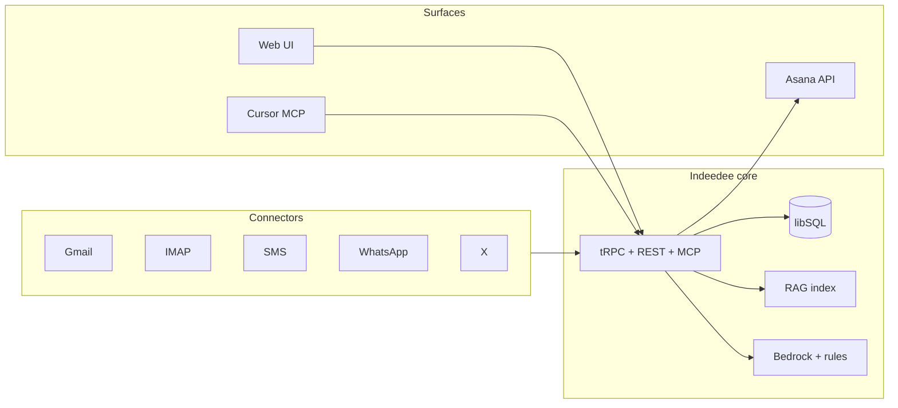

# Chief of Staff Communication Agent (Indeedee)

Unified executive communications agent — multi-channel inbox, RAG, AI recommendations, approval-gated send, Asana integration, web UI, and Cursor MCP. Built on the [Soofi XYZ Team Kit](https://github.com/soofi-xyz/soofi-xyz-team-kit).

## Context

The current Chief of Staff agent is not yet useful enough for executive operations. Setup is difficult, communication coverage is limited mainly to Gmail, and the system does not yet manage messages across all communication channels, brands, and workstreams. Executives need a unified agent that can understand communication context, recommend actions, draft responses in each user's style, connect decisions back to Asana, and help ensure every communication is answered in less than five minutes.

## Description

Build a Chief of Staff Communication Agent that connects all major communication channels, uses RAG to understand user and organizational context, recommends the next action for each message, drafts style-matched responses, links communications to the correct Asana work, and provides a UI and Cursor-accessible agent workflow for final approval and additional context.

## Quick start (local demo)

```bash
pnpm install
pnpm build
cp .env.example .env
# Generate INDEEDEE_SECRETS_KEY (required for demo connect):
# node -e "console.log(require('crypto').randomBytes(32).toString('base64'))"
# Add to .env as INDEEDEE_SECRETS_KEY=...
# Optional: INDEEDEE_SSO_ENABLED=false for local dev without Google login

pnpm --filter @indeedee/api dev
```

Open **http://localhost:8787** → click **Demo channels** → review **Dashboard**, **Incoming**, **People**, **Approvals**.

Full setup: [SETUP.md](./SETUP.md) · Production deploy: [DEPLOY.md](./DEPLOY.md) · Acceptance criteria: [ACCEPTANCE_CRITERIA.md](./ACCEPTANCE_CRITERIA.md)

## Demo video

**UI walkthrough (~26s)** — one-click demo connect, sync, dashboard metrics, kanban inbox, people threads, approvals queue, connections catalog, MCP config:

| | |
|--|--|
| **File** | [`demo/indeedee-chief-of-staff-demo.webm`](demo/indeedee-chief-of-staff-demo.webm) |
| **Format** | WebM — play in browser, VLC, or Cursor file preview |

**What the video shows:**

1. **Demo channels** — connect Gmail, email, SMS, WhatsApp, X and run sync + agent
2. **Dashboard** — inbound volume, overdue SLA, channel breakdown, recommended actions
3. **Incoming** — kanban with Reply / Asana task badges per message
4. **People** — cross-channel contact threads
5. **Approvals** — style-matched drafts with Approve & send
6. **Connections** — modular connector catalog (live OAuth + credentials)
7. **MCP** — Cursor agent integration

## Architecture



| Layer | Path | Role |
|-------|------|------|
| **API** | `apps/api` | REST, auth, tRPC, MCP, Lambda handlers |
| **UI** | `apps/web/public` | Dashboard, inbox, people, approvals, connections |
| **Connectors** | `packages/connectors` | Modular channel protocol |
| **Brain** | `packages/brain` | Recommend, draft, needs_context (Bedrock + rules) |
| **DB** | `packages/db` | libSQL messages, drafts, tokens (encrypted) |
| **Infra** | `infra/` | CDK — Lambda, CloudFront, EventBridge sync |
| **Tests** | `tests/acceptance/` | 39 acceptance criteria, 85 passing |

## Acceptance criteria

All 39 criteria in [ACCEPTANCE_CRITERIA.md](./ACCEPTANCE_CRITERIA.md) have registered test coverage. Run:

```bash
pnpm build && pnpm test
```

**Expected:** 85 passed · 13 skipped (live OAuth / Asana e2e without credentials)

## Cursor / MCP

```json
{
  "mcpServers": {
    "indeedee": {
      "url": "http://localhost:8787/mcp",
      "headers": { "X-Owner-Id": "demo-owner", "X-Role": "owner" }
    }
  }
}
```

Tools: `retrieve_context`, `list_pending`, `recommend_and_draft`, `approve_and_send`, `create_asana_task`, `sync`, `dashboard_stats`.

## Reference

- [Soofi XYZ Team Kit](https://github.com/soofi-xyz/soofi-xyz-team-kit) — engineering patterns, slowking self-assessment
- Kit skills: ash (agents), chatot (connectors), espeon (RAG), metagross (fullstack)

---

## Submission

### Pull request

| Item | Value |
|------|-------|
| **Repository** | `prismteam-ai/oracle-property-intelligence-platform-pipeline-completion` |
| **Path** | `chief-of-staff-communication-agent/` |
| **Branch** | `eran/indeedee-chief-of-staff` |
| **Base** | `main` |

### Demo video (required)

Short walkthrough of the working UI:

- **File in repo:** [`demo/indeedee-chief-of-staff-demo.webm`](demo/indeedee-chief-of-staff-demo.webm)
- **GitHub (after merge):** link in PR description to the blob URL on this branch

Scenes: Demo channels → Dashboard → Incoming → People → Approvals → Connections → MCP.

### Live / working runtime access

**Primary runtime (local — no AWS required):**

```bash
git clone <repo-url>
cd oracle-property-intelligence-platform-pipeline-completion/chief-of-staff-communication-agent
git checkout eran/indeedee-chief-of-staff

cp .env.example .env
# Set INDEEDEE_SECRETS_KEY (32-byte base64) and INDEEDEE_SSO_ENABLED=false
pnpm install && pnpm build
pnpm --filter @indeedee/api dev
```

Open **http://localhost:8787** → **Demo channels** → explore tabs.

| Tab | What to verify |
|-----|----------------|
| Dashboard | Metrics, channel breakdown, recommendations |
| Incoming | Kanban + action badges |
| People | Cross-channel threads |
| Approvals | Drafts + Approve & send |
| Connections | 5 demo channels connected |
| MCP | Cursor config snippet |

**Production (optional):** see [DEPLOY.md](./DEPLOY.md) for AWS CDK deploy.

### Self-assessment

Use the **slowking** agent from the [Soofi XYZ Team Kit](https://github.com/soofi-xyz/soofi-xyz-team-kit) before submitting.

### What assessors will evaluate

| Criterion | How this submission addresses it |
|-----------|----------------------------------|
| **Speed of delivery** | Kit-native TypeScript monorepo; demo mode works without live OAuth |
| **Architectural clarity** | Modular connectors, shared brain/RAG, thin API + Lambda deploy |
| **Working implementation** | 85 acceptance tests; UI demo video |
| **Reproducibility** | `.env.example`, SETUP.md, one-click demo seed |
| **Practical agentic AI** | Bedrock brain + MCP tools + Cursor plugin |
| **Tradeoffs** | LinkedIn unavailable (documented); rules fallback when Bedrock unset |
| **Demo quality** | Recorded UI video + interactive local runtime |
| **Evolvability** | New channel = new connector module; CDK infra for production |

## Acceptance Criteria (assignment)

- Support setup that is simple enough for non-technical users.
- Support email integrations across all required brands and accounts.
- Support Gmail as one email provider.
- Support additional email providers beyond Gmail.
- Support SMS integration.
- Support WhatsApp integration.
- Support X integration.
- Support LinkedIn integration.
- Support future communication channels through a modular connector architecture.
- Ingest messages, threads, metadata, participants, timestamps, and attachments where available.
- Consolidate all communication data into a centralized knowledge layer.
- Build a RAG layer using communication history, Asana context, user preferences, and organizational knowledge.
- Preserve conversation history across connected platforms.
- Learn and apply each user's response style.
- Recommend an action for every incoming communication.
- Draft suggested replies using relevant context and the user's communication style.
- Link related messages across channels when they belong to the same topic, person, customer, project, or decision.
- Connect communications clearly to relevant Asana tasks, projects, milestones, and comments.
- Create or update Asana tasks when a communication requires follow-up.
- Prompt the user for final approval before sending a drafted response.
- Prompt the user for additional context when the agent cannot confidently respond.
- Track whether each communication has been answered.
- Support the goal of answering every communication in less than five minutes.
- Provide a UI showing communication volume, response status, overdue messages, pending approvals, channel breakdown, and response-time metrics.
- Provide a UI view for recommended actions by communication.
- Provide a UI view for drafted responses awaiting approval.
- Provide an agent that can be used directly in Cursor.
- Allow the Cursor agent to retrieve communication context through the RAG layer.
- Allow the Cursor agent to recommend actions, draft responses, and update Asana.
- Securely authenticate and manage tokens for all connected services.
- Enforce user-specific permission boundaries across connected accounts.
- Demonstrate end-to-end ingestion from multiple channels.
- Demonstrate RAG-backed retrieval across communication and Asana context.
- Demonstrate recommended actions for incoming communications.
- Demonstrate style-matched draft replies.
- Demonstrate user approval before response delivery.
- Demonstrate Asana task creation or update from a communication.
- Document setup instructions for the Chief of Staff Communication Agent.
- Confirm the solution is reusable within the existing soofi-xyz agent ecosystem.
